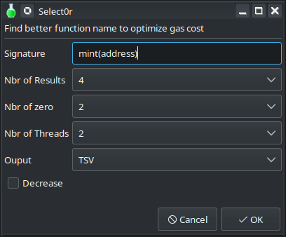

# Select0r

<!-- TOC -->

- [Select0r](#select0r)
	- [🔭 Overview](#-overview)
	- [📦 Install Rust](#-install-rust)
	- [🔧 Build](#-build)
	- [🚀 How to run](#-how-to-run)
		- [💻 Usage](#-usage)
		- [✏️ Parameters](#-parameters)
		- [👉 Examples](#-examples)
	- [📝 Results](#-results)
	- [🎉 Yad bonus !](#-yad-bonus-)
		- [📦 Installation](#-installation)
		- [💻 Script](#-script)
	- [TO DO](#to-do)

<!-- /TOC -->


## 🔭 Overview

Solidity functions can achieve higher efficiency when their function selector consists mainly of zeros. 

This tool helps you to generate a new selector for your Solidity contracts and save gas costs by using the smallest possible selector.

For instance :
- `sendValue(uint256 amount)` is **invalid**.
- `sendValue(uint256)` is the **correct** format.

The gas cost of a function name equals 4 times the number of zero bytes and 16 times the number of non-zero bytes. Therefore, the gas cost ranges from **28 gas** (*3 zeros and 1 non-zero*) in the best case to **64 gas** (*4 non-zero bytes*) in the worst case.

1. It's important to note that an all-zero function selector won't compile because it conflicts with the fallback function. Consequently, `mint_22F5A30(uint256)` (**0a000000**) is more gas-efficient than `mint(uint256)` (**a0712d68**).

2. Function selectors with **leading zeros** affect the operation of the function dispatcher and can be processed more quickly with less gas consumption.

This Rust program (**select0r**) is designed to find better names for an EVM (Ethereum Virtual Machine) function to optimize gas cost. It takes a function signature as input and performs calculations to find the best EVM function names in terms of gas cost.

For more informations about **gas optimisation** related to **function names**, go check **my article**, please follow and share it !

**Links :**
-  **[GitHub - Laugharne/Optimal_Function_Names](https://github.com/Laugharne/Optimal_Function_Names)**
- **[Optimisation des EVM, avec les noms de fonctions | Medium]( https://medium.com/@franck.maussand/optimisation-sur-ethereum-faites-la-diff%C3%A9rence-avec-les-noms-de-fonctions-ba4692c9e39f)** 🇫🇷
- **[Optimization on Ethereum: Make a Difference with Function Names](https://medium.com/coinsbench/optimization-on-ethereum-make-a-difference-with-function-names-9cc4a963424b)** 🇬🇧

**Feel free to [contact me !](mailto:franck@maussand.net)**

----

## 📦 Install Rust

[https://www.rust-lang.org/tools/install](https://www.rust-lang.org/tools/install)


## 🔧 Build

Build artifacts in release mode, with optimizations.

`cargo build --release`


----

## 🚀 How to run

Go into `release` sub-directory as working directory and launch `select0r`.


### 💻 Usage

`select0r s <function_signature string> z <number_of_zeros> r <max_results> l <leading_zero boolean> t <nbr_threads> o <format_ouput>`


### ✏️ Parameters

| Parameters | Parameter names      | Data types | Examples      | Domains              | Default       | Descriptions              |
| ---------- | -------------------- | ---------- | ------------- | -------------------- | ------------- | ------------------------- |
| **`s`**    | `function_signature` | string     | mint(address) | *(1)*                | **Mandatory** | Function signature *(1)*  |
| **`z`**    | `number_of_zeros`    | numeric    | 2             | [1..3]               | **2**         | Minimal # of zero *(2)*   |
| **`r`**    | `max_results`        | numeric    | 5             | [2..10]              | **4**         | # of needed result *(2)*  |
| **`l`**    | `leading_zero`       | boolean    | true          | true/false           | **false**     | *(3)*                     |
| **`t`**    | `nbr_threads`        | numeric    | 4             | [2..#cpu]            | **2**         | # of threads to use (*4*) |
| **`o`**    | `format_ouput`       | string     | xml           | tsv/csv/json/xml/ron | **tsv**       | File format output *(5)*  |

- *(1) : no spaces, no parameter names, just a [valid solidity signature](https://docs.soliditylang.org/en/develop/abi-spec.html#function-selector)*
- *(2) : higher it is, longer it is*
- *(3) : search for leading zeros in priority, slower if true*
- *(4) : hardware limitation (#CPU)*
- *(5) : File formats*
  - **tsv** *= [Tab Separated Value](https://en.wikipedia.org/wiki/Tab-separated_values)*
  - **csv** *= [Comma Separated Value](https://en.wikipedia.org/wiki/Comma-separated_values)*
  - **json** *= [JavaScript Object Notation](https://www.json.org/json-en.html)*
  - **xml** *= [Extensible Markup Language](https://en.wikipedia.org/wiki/XML)*
  - **ron** *= [Rusty Object Notation](https://github.com/ron-rs/ron)*
  

### 👉 Examples

```bash
select0r s "functionName(uint256)"  z 2  r 5  l true  t 2  o tsv
```

```bash
select0r s "functionName2(uint)"  z 2  r 7  l false  t 2  o json
```

```bash
select0r s "deposit(uint)"  z 2  r 7  l false  t 2  o xml
```


----

## 📝 Results

Get results for `execute()` signature looking for `2` lead zeros minimum, using `15` threads, stop after`8` results and put it as an `XML` file.

```bash
select0r s "execute()"  z 2  l true  t 15  r 8  o xml
```
An ouput file appears with the initial signature and some parameters in its name.

**File :** `select0r-execute()--zero=2-max=8-lead=true-cpu=15.XML`

```xml
<?xml version="1.0" encoding="UTF-8"?>
<select0r>
    <result>
        <selector>61461954</selector>
        <nbr_of_zero>0</nbr_of_zero>
        <leading_zero>0</leading_zero>
        <signature>execute()</signature>
    </result>
    <result>
        <selector>1b9b0000</selector>
        <nbr_of_zero>2</nbr_of_zero>
        <leading_zero>0</leading_zero>
        <signature>execute_1qn()</signature>
    </result>
    <result>
        <selector>00af0043</selector>
        <nbr_of_zero>2</nbr_of_zero>
        <leading_zero>1</leading_zero>
        <signature>execute_5Hw()</signature>
    </result>
    <result>
        <selector>00940050</selector>
        <nbr_of_zero>2</nbr_of_zero>
        <leading_zero>1</leading_zero>
        <signature>execute_6Ii()</signature>
    </result>
    <result>
        <selector>0000eb63</selector>
        <nbr_of_zero>2</nbr_of_zero>
        <leading_zero>2</leading_zero>
        <signature>execute_mAX()</signature>
    </result>
    <result>
        <selector>0000cf6d</selector>
        <nbr_of_zero>2</nbr_of_zero>
        <leading_zero>2</leading_zero>
        <signature>execute_G5J()</signature>
    </result>
    <result>
        <selector>00000622</selector>
        <nbr_of_zero>2</nbr_of_zero>
        <leading_zero>2</leading_zero>
        <signature>execute_06SF()</signature>
    </result>
    <result>
        <selector>000000ae</selector>
        <nbr_of_zero>3</nbr_of_zero>
        <leading_zero>3</leading_zero>
        <signature>execute_6d4S()</signature>
    </result>
</select0r>
```


--------


## 🎉 Yad bonus !

**Yad** (« [Yet Another Dialog](https://doc.ubuntu-fr.org/yad_yet_another_dialog) ») is a tool to create graphic dialog boxes with shell scripts.




### 📦 Installation

```bash
sudo apt install yad
```


### 💻 Script

There is the code to provide graphical interface to **select0r** tool.

Just set path to select0r binary executable and wrap it into a shell script or a bash function.

```bash
select0r=$(yad \
--title='Select0r' \
--form --width 400 --height 300 \
--field="<b>Find better function name to optimize gas cost.</b>":LBL '' \
--field="":LBL '' \
--field="Signature" 'mint(address)' \
--field="Nbr of Results":CB '1\!2\!3\!^4\!5\!6\!7\!8\!9\!10\!11\!12' \
--field="Nbr of zero":CB '1\!^2\!3' \
--field="Nbr of Threads":CB '1\!^2\!3\!4\!5\!6\!7\!8\!9\!10\!11\!12\!13\!14\!15\!16' \
--field="Ouput":CB '^TSV\!CSV\!JSON\!XML' \
--field="Leading 0":CHK 'FALSE' \
)
signature=$(echo "$select0r" | awk 'BEGIN {FS="|" } { print $3 }')
nn_result=$(echo "$select0r" | awk 'BEGIN {FS="|" } { print $4 }')
nn_zero=$(echo "$select0r" | awk 'BEGIN {FS="|" } { print $5 }')
nn_threads=$(echo "$select0r" | awk 'BEGIN {FS="|" } { print $6 }')
output=$(echo "$select0r" | awk 'BEGIN {FS="|" } { print $7 }')
decrease=$(echo "$select0r" | awk 'BEGIN {FS="|" } { print $8 }')
path_to_select0r/select0r  s $signature  z $nn_zero  l $decrease  t $nn_threads  r $nn_result  o $output
```

## TO DO

- Add : Rows of String Values (RSV) format ouput [GitHub - Stenway/RSV-Specification: Rows of String Values (RSV Data Format) Specification - A Binary Alternative to CSV](https://github.com/Stenway/RSV-Specification)
- Add : Simple Markup Language (SML) format output [SML - The Simple Markup Language](https://www.simpleml.com/)